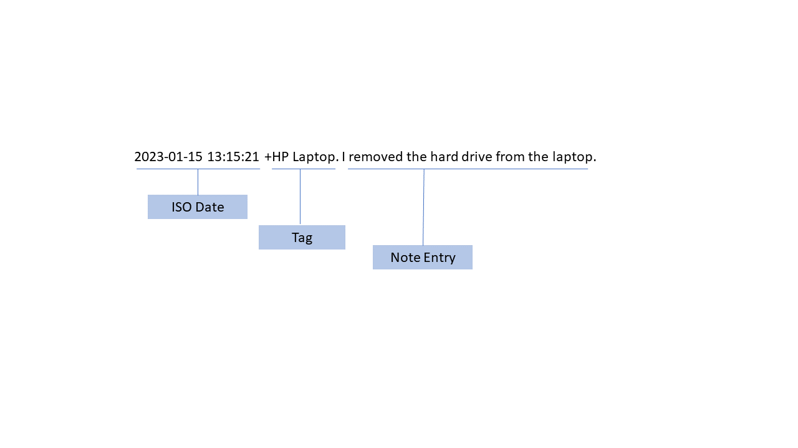

# bench-notes.txt

>**Keep It Simple** - Each line of text is a new note entry.

## Background

The Bench-notes.txt format is built on the idea of simplicity applied to note-taking, specifically ***contemporaneous note-taking*** as seen in the sciences and techincal fields. The format structure is inspired by the plain text format of [todo.txt](https://github.com/todotxt/todo.txt). The typical use case is informed by my work as a digital forensics and incident response (DFIR) professional, but the possibilities are only limited by ones imagination.

There are many pros to plain text. It is software and operating system agnostic. There is no lock in or dedicated software to be installed. It is portable and lightweight. Plain text can searched, manipulated, and highly compressed. It is unstructured and the ideal format for version control methodologies.

There is flexibility in working with plain text. Text editors are built into every operating system. Use your favorite GUI. Too cool for that? Use the command line/terminal. Prefer an IDE? Fine use that. Type it all manually or script it how you wish with any language you wish.

Bench-notes.txt is targeted to anyone who needs to take contemporaneous notes simply and quickly while completing a task or set/series of tasks.

## Format Rules

>**ISO Date +Tag. Note Entry.**

**Date** (Required): This is the ISO 8601 date and time. 24 hour clock. It can have a space or the designated 'T' separator between the date and time. As long as it is sortable. Choose one and stick with it. Don't mix and match.

**Tag** (optional): Tags allow for the grouping of notes. They are preceded by a plus sign (+) and end with a period. Multiple tags can be used. Tags must come before the note.

**Note Entry** (Required): This is your note. End it with a period.

Always use a space between the elements. End both the tag and the note with a period. Keep a blank line between entries for readability, but it isn't required.

## Practical Application

I created batch file, [bench-notes.bat]() as a proof of concept to illustrate the typical use case. It is just as simple to use manually combined with shortcuts in your OS and text app of choice.

>**Installation**
>
>Copy the batch file to the folder of your choice. 
>
>**Usage**
>
>Run the file. It creates the notes.txt file on its own. You will be given the option to either start taking notes, enter some basic case information, or quit. When you start taking notes, you can quit or return to the menu. If you choose to enter case info, you will be returned to the menu when finished.
>
>**Windows Only.**

## Enhancements

There are many ways to enhance this concept. A few examples:

- Use it with git for version control. Since it is text, it lives in the git wheel-house.
- Add/imbed screenshots by using markdown elements.
